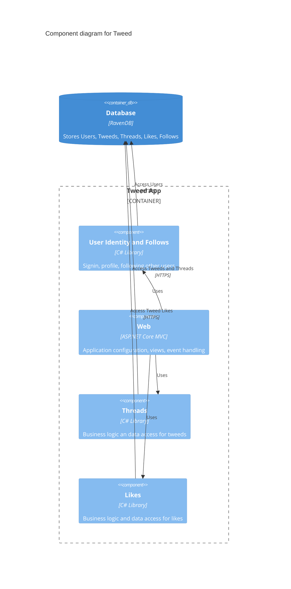

```mermaid
    C4Component
    title Component diagram for Tweed
    Container_Boundary(backend, "Tweed App") {
        Component(user, "User Identity and Follows", "C# Library", "Signin, profile, following other users")
        Component(web, "Web", "ASP.NET Core MVC", "Application configuration, views, event handling")
        Component(thread, "Threads", "C# Library", "Business logic an data access for tweeds")
        Component(like, "Likes", "C# Library", "Business logic and data access for likes")

        Rel(web, like, "Uses")
        Rel(web, thread, "Uses")
        Rel(web, user, "Uses")
        Rel(like, db, "Access Tweed Likes", "HTTPS")
        Rel(thread, db, "Access Tweeds and Threads", "HTTPS")
        Rel(user, db, "Access Users", "HTTPS")
    }

    ContainerDb(db, "Database", "RavenDB", "Stores Users, Tweeds, Threads, Likes, Follows")
    
    UpdateLayoutConfig($c4ShapeInRow="2", $c4BoundaryInRow="1")
```
