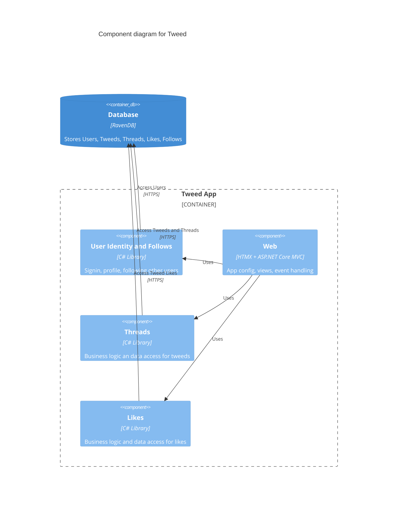

# Structure

The code is structured into components. Components are built around bounded contexts of the app, not file types. 
Layering is done within each component. 

## Components

There are 4 main components:
* `Tweed.User` for user identity and following other users
* `Tweed.Thread` for tweeds and threads
* `Tweed.Like` for liking tweeds
* `Tweed.Web` for app config, views, event handling

## Layering

The `Tweed.Web` component follows standard ASP.NET Core MVC folder structure for controllers and views. 
It has dependencies on other components that contain business logic 

The other components each come with two main folders:
* `Domain` contains business logic, aggregate objects, and repository interfaces for data access.
* `Infrastructure` contains implementations for above repositories for data access

## Tests

Each component has a corresponding test component with tests for domains (business logic) and 
infrastructure (data access).

Infrastrucure tests use 
